<!--
⭐ GitHub Profile README for MakazhanAlpamys
-->

<div align="center">
  
</div>

<div align="center">
  
</div>

<br>

<div align="center">
  
  
  <a href="https://www.linkedin.com/in/alpamys-makazhan-7059682a3/"></a>
</div>

<br>


<div align="center">

## 🌟 About Me

</div>

<table align="center">
<tr>
<td width="50%">

```yaml
name: Alpamys Makazhan
located_in: Kazakhstan 🇰🇿
current_job: Computer Science Student
education: 
  - "Associate of Applied Science in Software Development"
  - "Astana IT University College"
  - "Graduating: 2026"
  
fields_of_interests:
  - "Artificial Intelligence & Machine Learning"
  - "Computer Vision"
  - "Full-Stack Development" 
  - "Competitive Programming"
  - "Hackathons & Innovation"
```

</td>
<td width="50%">

### 🏆 **Achievements**
- 🥇 **1st Place** at Hackathons 2025
- 🚀 **Finalist** at Meta Llama Accelerator 2025
- 🎤 **Speaker** at Google DevFest 2024
- 🎯 **Speaker** at Terricon Valley 2025
- 🧠 **Finalist** at AITU ICODE Olympiad 2024

### 📫 **Let's Connect**
- 📧 [makazanalpamys@gmail.com](mailto:makazanalpamys@gmail.com)
- 💬 [@Th1men](https://t.me/Th1men) on Telegram
- 💼 [LinkedIn Profile](https://www.linkedin.com/in/alpamys-makazhan-7059682a3/)

</td>
</tr>
</table>


<div align="center">

## 🛠️ Tech Arsenal

</div>

<div align="center">

### Programming Languages
<p>
  
</p>

### Frontend & Mobile
<p>
  
</p>

### Backend & Databases  
<p>
  
</p>

### AI/ML & Tools
<p>
  
</p>

</div>

<div align="center">
  


</div>


<div align="center">

## 🚀 Featured Projects

</div>

<table align="center" width="100%">
<tr>
<td width="50%">

### 🤖 **FairTender**
> ML model detecting suspicious procurements with **96.1% accuracy** (XGBoost + SHAP) + Streamlit dashboard

### ♟️ **Chess.AI** 
> AI-powered chess learning platform with Stockfish & Chess.js integration

</td>
<td width="50%">

### 🔍 **Fake News Detector**
> LLM-powered fact-checking web app with confidence scoring

### 🧬 **AiBio** 
> 🥇 **1st Place Hackathon project**: biology learning platform with AI tutor & 3D models

</td>
</tr>
</table>

<div align="center">

### 🦙 **Meta Llama Accelerator Project**
> AI-powered solution (Finalist project details coming soon...)

</div>


<div align="center">

## 📊 GitHub Analytics

</div>

<div align="center">
   
  
</div>

<div align="center">
  
</div>

<div align="center">
  
</div>


<div align="center">

## 🎤 Speaking & Activities

</div>

<table align="center">
<tr>
<td align="center" width="33%">

### 🎯 **Google DevFest 2024**
*AI & Big Data in Real-World Applications*

</td>
<td align="center" width="33%">

### 🚀 **Terricon Valley 2025**
*How to Build an MVP from an Idea*

</td>
<td align="center" width="33%">

### 🏆 **AITU ICODE Olympiad 2024**
*Finalist in Algorithms & Data Structures*

</td>
</tr>
</table>


<div align="center">

## 🎯 Goals 2025

```mermaid
graph LR
    A[🌟 2025 Roadmap] --> B[📚 Open Source<br/>Contribute to AI tools]
    A --> C[📦 Publish<br/>pip package]
    A --> D[🏆 Hackathons<br/>Win or mentor 2+]
    
    style A fill:#0d1117,stroke:#00d9ff,stroke-width:2px,color:#00d9ff
    style B fill:#1a1a2e,stroke:#00d9ff,stroke-width:1px,color:#ffffff
    style C fill:#1a1a2e,stroke:#00d9ff,stroke-width:1px,color:#ffffff
    style D fill:#1a1a2e,stroke:#00d9ff,stroke-width:1px,color:#ffffff
```

</div>

<div align="center">



</div>


<div align="center">
  
</div>

<div align="center">
  
**💫 Made with ❤️ by Alpamys Makazhan**

*⭐ Star the repos you like! Let's build something amazing together! 🚀*

</div>
