<!--
⭐ GitHub Profile README for MakazhanAlpamys - CYBERPUNK EDITION
-->

<div align="center">
  
</div>

<div align="center">
  
</div>

<br>

<div align="center">
  
  
  <a href="https://www.linkedin.com/in/alpamys-makazhan-7059682a3/"></a>
</div>

<br>

```
╔══════════════════════════════════════════════════════════════════════════════╗
║  ██████╗██╗   ██╗██████╗ ███████╗██████╗ ██████╗ ██╗   ██╗███╗   ██╗██╗  ██╗ ║
║ ██╔════╝╚██╗ ██╔╝██╔══██╗██╔════╝██╔══██╗██╔══██╗██║   ██║████╗  ██║██║ ██╔╝ ║
║ ██║      ╚████╔╝ ██████╔╝█████╗  ██████╔╝██████╔╝██║   ██║██╔██╗ ██║█████╔╝  ║
║ ██║       ╚██╔╝  ██╔══██╗██╔══╝  ██╔══██╗██╔═══╝ ██║   ██║██║╚██╗██║██╔═██╗  ║
║ ╚██████╗   ██║   ██████╔╝███████╗██║  ██║██║     ╚██████╔╝██║ ╚████║██║  ██╗ ║
║  ╚═════╝   ╚═╝   ╚═════╝ ╚══════╝╚═╝  ╚═╝╚═╝      ╚═════╝ ╚═╝  ╚═══╝╚═╝  ╚═╝ ║
╚══════════════════════════════════════════════════════════════════════════════╝
```

<div align="center">

## ⚡ SYSTEM INFORMATION

</div>

<table align="center">
<tr>
<td width="50%">

```yaml
[IDENTITY]
>>> handle: Alpamys Makazhan
>>> location: Kazakhstan 🇰🇿
>>> status: ONLINE
>>> role: Computer Science Student
>>> mission: Building the Future

[EDUCATION.LOG]
>>> degree: "AAS in Software Development"
>>> institution: "Astana IT University College"
>>> graduation: 2026
>>> progress: [████████░░] 80%

[SPECIALIZATION]
>>> AI & Machine Learning
>>> Computer Vision Systems
>>> Full-Stack Architecture
>>> Competitive Programming
>>> Innovation & Hackathons
```

</td>
<td width="50%">

### 🏆 **ACHIEVEMENT_LOG**
```bash
[2025] 🥇 HACKATHON_WINNER >> 1st Place
[2025] 🚀 META_LLAMA >> Finalist Status
[2024] 🎤 GOOGLE_DEVFEST >> Speaker Access
[2025] 🎯 TERRICON_VALLEY >> Speaker Panel
[2024] 🧠 AITU_ICODE >> Finalist Rank
```

### 📡 **CONNECT.SH**
```bash
$ email    >> makazanalpamys@gmail.com
$ telegram >> @Th1men
$ linkedin >> alpamys-makazhan-7059682a3
$ status   >> Available for collaboration
```

</td>
</tr>
</table>

```
▓▓▓▓▓▓▓▓▓▓▓▓▓▓▓▓▓▓▓▓▓▓▓▓▓▓▓▓▓▓▓▓▓▓▓▓▓▓▓▓▓▓▓▓▓▓▓▓▓▓▓▓▓▓▓▓▓▓▓▓▓▓▓▓▓▓▓▓▓▓▓▓▓▓▓▓▓▓
```

<div align="center">

## 🎮 TECH_STACK.EXE

</div>

<div align="center">

### 『 PROGRAMMING LANGUAGES 』
<table>
<tr>
<td align="center" width="96">

<br>Python
</td>
<td align="center" width="96">

<br>C#
</td>
<td align="center" width="96">

<br>Java
</td>
<td align="center" width="96">

<br>JavaScript
</td>
<td align="center" width="96">

<br>TypeScript
</td>
<td align="center" width="96">

<br>Dart
</td>
</tr>
</table>

### 『 FRONTEND & MOBILE 』
<table>
<tr>
<td align="center" width="96">

<br>React
</td>
<td align="center" width="96">

<br>Flutter
</td>
<td align="center" width="96">

<br>HTML5
</td>
<td align="center" width="96">

<br>CSS3
</td>
<td align="center" width="96">

<br>Tailwind
</td>
<td align="center" width="96">

<br>Bootstrap
</td>
</tr>
</table>

### 『 BACKEND & DATABASES 』
<table>
<tr>
<td align="center" width="96">

<br>Node.js
</td>
<td align="center" width="96">

<br>Express
</td>
<td align="center" width="96">

<br>PostgreSQL
</td>
<td align="center" width="96">

<br>MongoDB
</td>
<td align="center" width="96">

<br>Redis
</td>
<td align="center" width="96">

<br>Docker
</td>
</tr>
</table>

### 『 AI/ML & TOOLS 』
<table>
<tr>
<td align="center" width="96">

<br>TensorFlow
</td>
<td align="center" width="96">

<br>PyTorch
</td>
<td align="center" width="96">

<br>OpenCV
</td>
<td align="center" width="96">

<br>Git
</td>
<td align="center" width="96">

<br>GitHub
</td>
<td align="center" width="96">

<br>VS Code
</td>
</tr>
</table>

</div>

```
▓▓▓▓▓▓▓▓▓▓▓▓▓▓▓▓▓▓▓▓▓▓▓▓▓▓▓▓▓▓▓▓▓▓▓▓▓▓▓▓▓▓▓▓▓▓▓▓▓▓▓▓▓▓▓▓▓▓▓▓▓▓▓▓▓▓▓▓▓▓▓▓▓▓▓▓▓▓
```

<div align="center">

## 💾 PROJECTS.DATABASE

</div>

<table align="center" width="100%">
<tr>
<td width="50%">

### 🤖 **FairTender**
```python
# ML-powered procurement analysis
accuracy = 96.1%
algorithm = "XGBoost + SHAP"
interface = "Streamlit Dashboard"
status = "DEPLOYED"
```

### ♟️ **Chess.AI** 
```javascript
// AI chess learning platform
engine: "Stockfish Integration"
library: "Chess.js"
features: ["AI Tutor", "Analysis"]
status: "ACTIVE"
```

</td>
<td width="50%">

### 🔍 **Fake News Detector**
```python
# LLM fact-checking system
model = "Large Language Model"
features = ["Confidence Score"]
interface = "Web Application"
status = "OPERATIONAL"
```

### 🧬 **AiBio** 
```yaml
achievement: "🥇 1st Place Hackathon"
type: "Biology Learning Platform"
features: ["AI Tutor", "3D Models"]
impact: "HIGH"
```

</td>
</tr>
</table>

<div align="center">

### 🦙 **Meta Llama Accelerator**
```bash
$ project_status >> FINALIST
$ category >> AI Innovation
$ details >> [CLASSIFIED] Coming Soon...
```

</div>

```
▓▓▓▓▓▓▓▓▓▓▓▓▓▓▓▓▓▓▓▓▓▓▓▓▓▓▓▓▓▓▓▓▓▓▓▓▓▓▓▓▓▓▓▓▓▓▓▓▓▓▓▓▓▓▓▓▓▓▓▓▓▓▓▓▓▓▓▓▓▓▓▓▓▓▓▓▓▓
```

<div align="center">

## 📊 ANALYTICS.SYS

</div>

<div align="center">
   
  
</div>

<div align="center">
  
</div>

<div align="center">
  
</div>

```
▓▓▓▓▓▓▓▓▓▓▓▓▓▓▓▓▓▓▓▓▓▓▓▓▓▓▓▓▓▓▓▓▓▓▓▓▓▓▓▓▓▓▓▓▓▓▓▓▓▓▓▓▓▓▓▓▓▓▓▓▓▓▓▓▓▓▓▓▓▓▓▓▓▓▓▓▓▓
```

<div align="center">

## 🎤 EVENTS.LOG

</div>

<table align="center">
<tr>
<td align="center" width="33%">

```yaml
event: Google DevFest
year: 2024
role: SPEAKER
topic: "AI & Big Data"
```

</td>
<td align="center" width="33%">

```yaml
event: Terricon Valley
year: 2025
role: SPEAKER
topic: "MVP Building"
```

</td>
<td align="center" width="33%">

```yaml
event: AITU ICODE
year: 2024
role: FINALIST
category: "Algorithms"
```

</td>
</tr>
</table>

```
▓▓▓▓▓▓▓▓▓▓▓▓▓▓▓▓▓▓▓▓▓▓▓▓▓▓▓▓▓▓▓▓▓▓▓▓▓▓▓▓▓▓▓▓▓▓▓▓▓▓▓▓▓▓▓▓▓▓▓▓▓▓▓▓▓▓▓▓▓▓▓▓▓▓▓▓▓▓
```

<div align="center">

## 🎯 MISSION_2025.EXE

```mermaid
graph LR
    A[⚡ 2025 OBJECTIVES] --> B[📚 Open Source<br/>Contribute to AI]
    A --> C[📦 PyPI Package<br/>Publish Library]
    A --> D[🏆 Hackathons<br/>Win + Mentor]
    
    style A fill:#0a0a0a,stroke:#ff00ff,stroke-width:3px,color:#00ffff
    style B fill:#1a0a1a,stroke:#00ffff,stroke-width:2px,color:#ffffff
    style C fill:#1a0a1a,stroke:#00ffff,stroke-width:2px,color:#ffffff
    style D fill:#1a0a1a,stroke:#00ffff,stroke-width:2px,color:#ffffff
```

</div>

<div align="center">



</div>

```
▓▓▓▓▓▓▓▓▓▓▓▓▓▓▓▓▓▓▓▓▓▓▓▓▓▓▓▓▓▓▓▓▓▓▓▓▓▓▓▓▓▓▓▓▓▓▓▓▓▓▓▓▓▓▓▓▓▓▓▓▓▓▓▓▓▓▓▓▓▓▓▓▓▓▓▓▓▓
```

<div align="center">
  
</div>

<div align="center">
  
```
╔════════════════════════════════════════════════════════════╗
║                                                            ║
║  ⚡ CRAFTED WITH CODE BY ALPAMYS MAKAZHAN ⚡              ║
║                                                            ║
║  ⭐ Star repos you like | Let's hack the future! 🚀       ║
║                                                            ║
╚════════════════════════════════════════════════════════════╝
```


</div>
